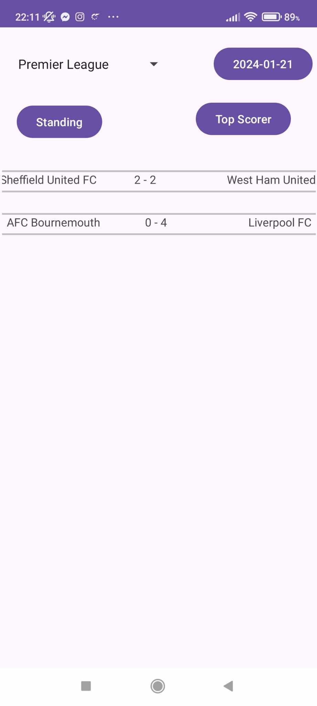
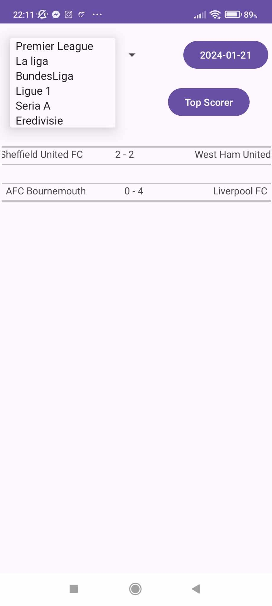
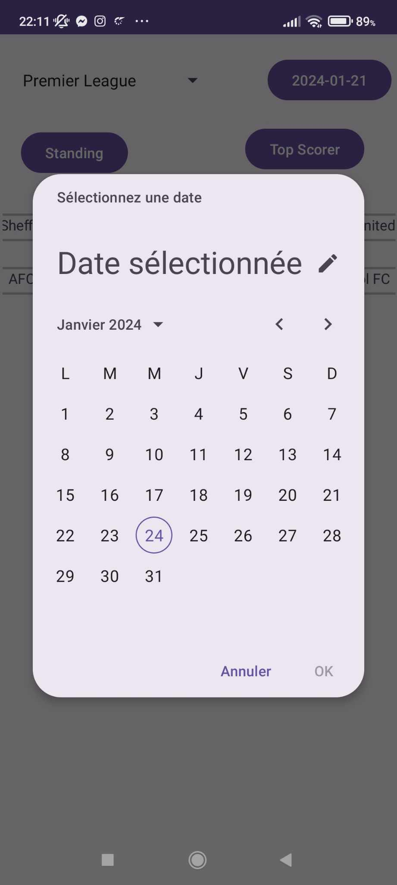
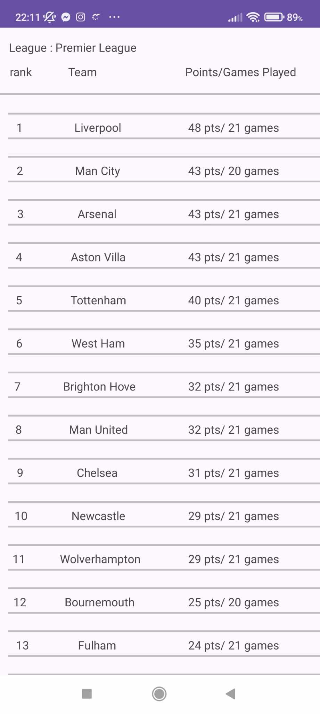
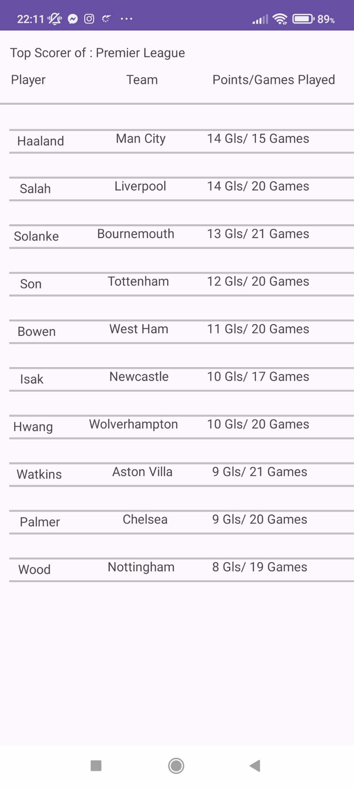
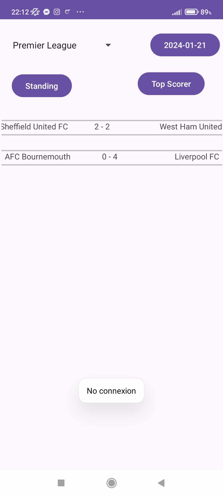

<h2><b>Examen TP </b></h2>
<ul>
  <li>
    <h4>Choix de l'API :</h4>
  </li>
    L'url de l'api : https://api.football-data.org  
    L'objectif de l'API : Fournit des données et des statistiques de football. 
    Il necessite un clé API
  <li>
    <h4>Fonctionnalités de l'Application :</h4>
  </li>
    L'application comporte 3 activitées :
        <h5>
          <b>1 - GameActivity :</b>
        </h5> 
          
         C'est la MainActivity elle affiche les résultat des matches d'une Date (Bouton pour changer la date) et compétition (Spinner pour changer la compétition) données. 
        Elle Comporte aussi 2 bouton pour naviguer vers les 2 autres activitées Classement et Meilleur Buteur.  
        
          
        <h5><b>2 - ClassementActivity :</b></h5>
         Elle affiche le classement d'une ligue (passé en Intent par la mainActivity)  
           
        <h5><b>3 - ScorerActivity :</b></h5>
         Elle affiche le classement des meilleur buteurs d'une ligue (passé en Intent par la mainActivity)  
         
    <li>
         <h4>Gestion des Erreurs de Connexion :</h4>
      </li>  
      Dans la MainActivity on vérifie la connexion internet avant de faire : 
      -Changer la compétition ou la date  
      -Avant de naviguer vers les 2 autres activitées 
      Si on détecte l'absence de connexion Internet on ne fait pas l'action et on affiche un Toast pour informer l'utilisateur  
      
  <li>
    <h4>Architecture et autres :</h4>
  </li>
  Pour tout les activitées on a utilisé l'architecture MVVM. 
  Pour l'interaction avec l'api on a utilisé Retrofit.
</ul>
